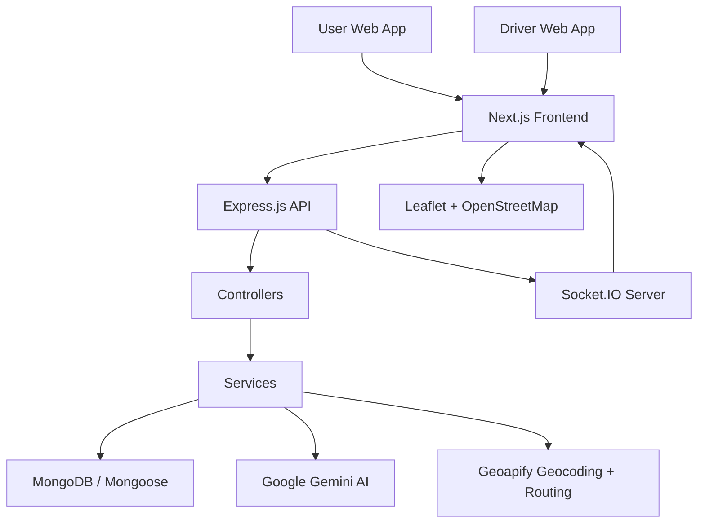

# NavGati

NavGati is an AI-powered ride booking and management platform built for a modern full-stack workflow where users describe trips in natural language, the system interprets intent, matches ride options, and coordinates the booking lifecycle between passengers and drivers in real time. The project combines a Next.js frontend, an Express.js + MongoDB backend, AI-based trip analysis using Gemini, geolocation/routing via Geoapify, and Socket.IO-driven live ride updates.

---

## Table of Contents

- [Overview](#overview)
- [Key Features](#key-features)
  - [User Features](#user-features)
  - [AI Features](#ai-features)
  - [Ride & Booking Features](#ride--booking-features)
  - [Driver Features](#driver-features)
  - [Authentication & Security](#authentication--security)
  - [Real-Time Features](#real-time-features)
  - [Geolocation / Maps](#geolocation--maps)
  - [Dashboard Features](#dashboard-features)
- [System Architecture](#system-architecture)
- [Technology Stack](#technology-stack)
- [Application Workflow](#application-workflow)
  - [User Flow](#user-flow)
  - [Driver Flow](#driver-flow)
- [AI Ride Analysis](#ai-ride-analysis)
- [Environment Configuration](#environment-configuration)
- [Project Structure](#project-structure)
- [Running the Project](#running-the-project)
- [Notes and Current Scope](#notes-and-current-scope)

---

## Overview

NavGati is designed around a simple but complete ride booking loop: a user describes a trip in natural language, the backend interprets the request, identifies pickup and destination, calculates a route, finds qualifying available drivers, and presents ranked ride recommendations. Once a ride is selected, the system creates a booking, notifies a driver, and tracks acceptance, start, progress, completion, and cancellation with real-time updates.

The platform separates user and driver experiences. Users authenticate through local email/password flow or Google OAuth, while drivers use a dedicated driver registration and login flow with vehicle and license information. The backend enforces separate JWT-based protection for each role via dedicated middleware.

AI is used for ride-request interpretation rather than autonomous booking decisions. The backend calls a Gemini model to extract structured request fields such as pickup, destination, date, time, passengers, luggage, ride type, and preferences. Those extracted values are validated and then used as inputs for availability checks, route calculation, fare estimation, and ranking.

From a technical perspective, the system connects:

- Next.js client screens for user and driver workflows
- Express.js REST controllers for authentication, ride analysis, booking, and driver actions
- MongoDB via Mongoose for users, drivers, and booking records
- Geoapify for geocoding and route data
- Socket.IO for live room-based ride communication
- Google OAuth and JWT for user identity management

---

## Key Features

### User Features

- User registration with name, email, password, and phone
- User login/logout with JWT cookie-based authentication
- Persistent user session retrieval via `getmeUser`
- AI-assisted trip input from a conversational text prompt
- Ride recommendation list based on extracted requirements and driver availability
- Booking creation for a selected recommended driver
- Booking lookup and user booking history
- Booking cancellation before the ride is started or while it remains in cancelable states
- Saved user profile information in the schema, including `savedLocations`

### AI Features

- Natural-language ride request analysis using Google Gemini (`gemini-3.6-flash`)
- Structured extraction of request fields: `pickup`, `destination`, `date`, `time`, `passengers`, `luggage`, `rideType`, and `preferences`
- JSON response enforcement using the Google GenAI SDK schema validation
- Recommendation scoring based on driver rating, fare, ETA, verification status, and safety preference
- Route and fare calculation triggered after AI extraction to keep ride options grounded in actual trip data

### Ride & Booking Features

- Booking model with pickup and destination location objects, route summary, estimated duration, fare, and lifecycle status
- Booking statuses include `requested`, `accepted`, `ongoing`, `rejected`, `cancelled`, and `completed`
- Driver availability checks before ride allocation
- Driver verification required for booking creation
- Ride rejection and start/complete flow for drivers
- Fare estimation based on distance and vehicle type
- User-side booking status tracking and live ride state updates

### Driver Features

- Driver registration with username, email, password, phone, license number, license expiry, and vehicle metadata
- Separate driver login/logout flow using a distinct `driverToken` cookie
- Driver profile and record retrieval via `getmeDriver`
- Driver availability toggle (`isAvailable`)
- Pending booking retrieval for assigned driver requests
- Booking acceptance or rejection
- Ride start and completion transitions
- Driver earnings summary with historical ride and weekly metrics
- Driver dashboard sections for overview, requests, earnings, safety, and route status

### Authentication & Security

- JWT-based session management for both users and drivers
- User middleware and driver middleware verify cookies and attach authenticated user/driver objects to requests
- Password hashing with `bcrypt`
- User Google OAuth flow via `google-auth-library`
- Local account and Google account handling in the user schema via `authProvider`
- Role-based route separation using dedicated auth endpoints

### Real-Time Features

- Socket.IO server with room-based communication
- Driver room join: `join-driver`
- Booking room join: `join-booking`
- Shared live location updates: `location-update`
- Ride start broadcast: `ride-started`
- Ride completion broadcast: `ride-completed`
- Booking cancellation broadcast via `ride-cancelled`
- Booking room exit: `leave-booking`
- Real-time location sharing between user and driver during accepted/ongoing trips

### Geolocation / Maps

- Geoapify-based address geocoding for pickup and destination lookup
- Geoapify route calculation between coordinates with distance and duration
- Frontend map rendering with Leaflet and OpenStreetMap tiles
- Live driver and passenger position updates on the map
- Pickup and destination markers with map-centering behavior for active rides

### Dashboard Features

- User dashboard with AI trip input, dynamic ride recommendations, and live ride map
- Driver dashboard with overview, pending requests, active ride details, and earnings
- Recent trip collection on the user dashboard
- Ride status cards and live route/booking UI states

---

## System Architecture

The current implementation follows a layered architecture centered on REST APIs and real-time communication:



### Frontend responsibilities

- User and driver login/register screens
- AI trip form for natural-language ride requests
- Recommendation cards and ride booking actions
- Driver dashboard for pending and current rides
- Live map and route display using Leaflet
- Real-time socket event listeners for booking and location updates

### Backend responsibilities

- Route registration and API prefixing in `src/app.js`
- JWT verification for authenticated users and drivers
- Controller logic for registration, login, ride analysis, booking, and driver actions
- Business logic in service modules such as `ai.service.js`, `matching.service.js`, `recommendation.service.js`, `fare.service.js`, and booking services
- Socket.IO server setup and room-based event management in `server.js`

### Database layer

- MongoDB is the primary persistence layer
- Mongoose schemas are defined for:
  - `User`
  - `Driver`
  - `Booking`
- Booking records store pickup and destination coordinates, route data, fare, and booking lifecycle status

### AI service layer

- `Backend/src/Services/ai.service.js` creates a `GoogleGenAI` client with `process.env.GEMINI_API_KEY`
- The model is `gemini-3.6-flash`
- User text is converted into structured JSON using a schema with fields for pickup, destination, date, time, passengers, luggage, rideType, and preferences

### Real-time communication

- The backend creates a Socket.IO server attached to the HTTP server
- Clients connect to the backend using `socket.io-client`
- Rooms are used to deliver events to specific drivers and active bookings
- The implementation currently handles location sharing and booking lifecycle updates

### External APIs and services

- Google Gemini for AI ride parsing
- Geoapify for geocoding and route calculation
- OpenStreetMap for map tiles via Leaflet
- Google OAuth for user sign-in

---

## Technology Stack

| Layer | Technology | Purpose |
| --- | --- | --- |
| Frontend | Next.js 16, React 19, TypeScript | App shell, routing, user/driver interfaces |
| Styling | Tailwind CSS | UI styling and layout |
| Motion | Framer Motion | Animated interface elements |
| Icons | Lucide React | Interface icons |
| Maps | Leaflet, React Leaflet, OpenStreetMap | Display pickup, destination, and live ride locations |
| Real-time | Socket.IO, socket.io-client | Live booking and location synchronization |
| Backend | Node.js, Express.js | API server, middleware, route handling |
| Database | MongoDB, Mongoose | Persistence for users, drivers, and bookings |
| Authentication | JWT, bcrypt, Google OAuth | Local auth, hashed passwords, and Google sign-in |
| AI | Google GenAI / Gemini | Ride request analysis and structured extraction |
| Location APIs | Geoapify API | Address lookup and route calculations |
| Deployment | Docker (backend) | Containerized backend runtime |

---

## Application Workflow

### User Flow

1. A user registers or logs in through the user auth flow.
2. The user opens the AI booking panel and enters a natural-language trip request.
3. The frontend sends a POST request to `/api/ride-requests/analyze` using the authenticated user session.
4. The backend calls Gemini to extract the structured request.
5. The system validates that pickup and destination are available and converts them to coordinates via Geoapify.
6. The route is calculated to compute distance and duration.
7. The backend finds available, verified drivers whose vehicle seats meet the passenger count and whose vehicle type matches the desired ride type when specified.
8. Fare is calculated per ride type and recommendation scores are assigned.
9. The app presents ranked ride options to the user.
10. The user books a recommended driver.
11. The backend creates a booking record with `requested` status and assigns the selected driver.
12. The driver receives the pending request through the driver dashboard and booking APIs.
13. The driver accepts or rejects the booking.
14. If accepted, booking status moves to `accepted` and then `ongoing` once the ride starts.
15. Socket.IO broadcasts location updates and ride state changes to the associated booking room.
16. The ride ends with driver completion, and the booking status becomes `completed`.

### Driver Flow

1. A driver registers with license, vehicle, and identity details.
2. The driver logs in using a dedicated driver auth flow.
3. The driver toggles availability so they can receive ride requests.
4. Driver receives pending bookings assigned to them.
5. Driver can accept or reject the request based on status and current availability.
6. Once accepted, the driver can start the ride and mark it as ongoing.
7. The app tracks live rider and driver location updates through Socket.IO.
8. The driver completes the trip, which updates the booking state and marks the driver available again.
9. Driver earnings and ride summaries are aggregated from completed booking records.

---

## AI Ride Analysis

The AI ride-analysis flow is implemented in `Backend/src/Services/ai.service.js` and is directly used by `Backend/src/Controllers/ride.controller.js`.

### How requests are received

The frontend captures free-form text from the user in the AI trip input component and sends it to the backend using the authenticated route:

- `POST /api/ride-requests/analyze`

The request body is expected to include a `text` field, which is then processed by the backend.

### AI provider and model

The project uses the Google GenAI SDK with the Gemini model:

- `gemini-3.6-flash`

The service initializes the client with `process.env.GEMINI_API_KEY`.

### Structured extraction

The AI prompt instructs the model to extract:

- pickup
- destination
- date
- time
- passengers
- luggage
- rideType
- preferences

The schema requires valid JSON with these field types and defaults:

- `pickup`, `destination`, `date`, `time`: string or null
- `passengers`: integer or null
- `luggage`: boolean
- `rideType`: string
- `preferences`: array of strings

The actual implementation explicitly says:

- no distance should be calculated by the AI
- no fare should be calculated by the AI
- no driver should be recommended by the AI
- missing information should be represented as `null`

### How the result is used

After AI parsing, the backend performs the following steps:

1. Checks that pickup and destination exist
2. Resolves both to coordinates using Geoapify geocoding
3. Calculates route distance and duration using Geoapify routing
4. Finds available and verified drivers
5. Estimates fare based on distance and ride type
6. Generates ride recommendations using a scoring algorithm

### Failure behavior

If the AI analysis fails or the request is invalid, the backend responds with a `500` status and returns the underlying `error.message` in the response payload. The code also rejects bookings when required trip data is missing.

### Example

A user prompt such as:

> "I need a sedan from Vashi to Mumbai Airport tomorrow at 7 PM for 3 people with 2 bags."

is interpreted into a structured payload that includes the trip fields above and is then processed by the routing, matching, and fare logic. The AI layer does not directly compute fare or choose a driver; it extracts the trip data and hands off the structured request to the downstream services.

---

## Environment Configuration

The repository includes environment variable examples in both backend and frontend folders:

- `Backend/.env.example`
- `Frontend/client/.env.example`

The backend expects variables such as:

- `PORT`
- `JWT_SECRET`
- `MONGO_URI`
- `GEMINI_API_KEY`
- `GEOAPIFY_API_KEY`
- `GOOGLE_CLIENT_ID`
- `GOOGLE_CLIENT_SECRET`
- `GOOGLE_CALLBACK_URL`
- `FRONTEND_URL`

The frontend uses:

- `NEXT_PUBLIC_BACKEND_URL`
- `NEXT_PUBLIC_SOCKET_URL`

These values should be kept out of source control and only referenced by variable name in documentation or configuration files.

---

## Project Structure

```text
NavGati/
├── Backend/
│   ├── .dockerignore
│   ├── .env.example
│   ├── Dockerfile
│   ├── README.md
│   ├── package.json
│   ├── package-lock.json
│   ├── server.js
│   └── src/
│       ├── app.js
│       ├── Config/
│       ├── Controllers/
│       ├── Middlewares/
│       ├── Models/
│       ├── Routes/
│       └── Services/
├── Frontend/
│   └── client/
│       ├── .env.example
│       ├── README.md
│       ├── app/
│       ├── package.json
│       ├── package-lock.json
│       └── public/
├── LICENSE
└── README.md
```

This repository contains a backend package, a frontend package, and a root-level README that documents the overall project.

---

## Running the Project

### Backend

From the `Backend` directory:

```bash
npm install
npm run dev
```

The backend starts through `server.js` and listens on the configured `PORT` value. The app attaches Socket.IO to the HTTP server and connects to MongoDB using `MONGO_URI`.

### Frontend

From the `Frontend/client` directory:

```bash
npm install
npm run dev
```

The frontend is a Next.js client app and relies on `NEXT_PUBLIC_BACKEND_URL` and `NEXT_PUBLIC_SOCKET_URL` for backend API access and real-time communication.

### Containerized backend

A Dockerfile is present under `Backend/Dockerfile` for building a Node.js image for the backend service.

---

## Notes and Current Scope

This project is a working full-stack ride-booking application with distinct user and driver flows, AI trip interpretation, geolocation-based route analysis, and live booking updates. The codebase includes integrated support for Gemini-based trip analysis, Geoapify geocoding/routing, MongoDB persistence, JWT auth, Google OAuth for users, and Socket.IO-based real-time communication.

The implementation is real and not a conceptual mockup. Some UI sections are present for driver dashboard states and static information panels, but the backend and frontend logic currently center on the booking lifecycle, AI trip analysis, route matching, and live ride tracking described above.

---

NavGati demonstrates a practical full-stack architecture for AI-assisted ride booking, with clear separation between passenger workflows, driver workflows, backend services, and real-time communication channels.
